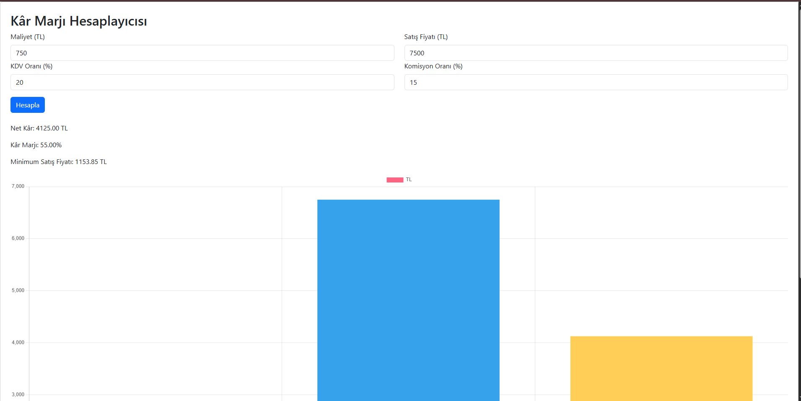

# 💰 Kâr / Zarar Hesaplama Aracı – React.js Mini App

Bu proje, kullanıcıların **ürün maliyeti**, **KDV oranı**, **satış fiyatı** ve **komisyon oranı** bilgilerini girerek **kâr veya zarar oranını** görselleştirmesini sağlayan bir React.js uygulamasıdır.  
Grafiksel gösterim sayesinde, farklı senaryoların sonuçlarını anlık olarak analiz edebilirsiniz. Basit, boş vakitde geliştirilen bir uygulamadır.

---

## 🚀 Özellikler

- 📊 **Dinamik Chart Görselleştirme:**  
  Girilen veriler anında grafiğe yansıtılır.  
- 🧮 **Gerçek Zamanlı Hesaplama:**  
  Kâr, zarar ve kâr yüzdesi otomatik hesaplanır.  
- ⚙️ **KDV ve Komisyon Desteği:**  
  Net Kaar ve Kaar marjı gösterir. Minimum satış fiyatı ile zararına satış önlenir.
- 💡 **Modern React Yapısı:**  
  React JS ile geliştirildi.

---

## 🧠 Kullanım Amacı

E-ticaret yapan kişiler, perakende satış yapanlar veya işletme sahipleri için:  
**“Satış fiyatı üzerinden ne kadar kazanç veya kayıp elde ettiğinizi hızlıca görmek.”**

Bu araç, fiyatlandırma stratejinizi belirlerken büyük kolaylık sağlar.

---

## 🧩 Kullanılan Teknolojiler

| Teknoloji | Açıklama |
|------------|-----------|
| **React.js** | Arayüz geliştirme |
| **Chart.js / Recharts** | Grafik görselleştirme |

---

## 📷 Ekran Görüntüsü



```bash


# 1. Depoyu klonla
git clone https://github.com/xbyildirim/kar-zarar-hesaplayici.git

# 2. Klasöre gir
cd kar-zarar-hesaplayici

# 3. Gerekli paketleri yükle
npm install

# 4. Uygulamayı başlat
npm run dev